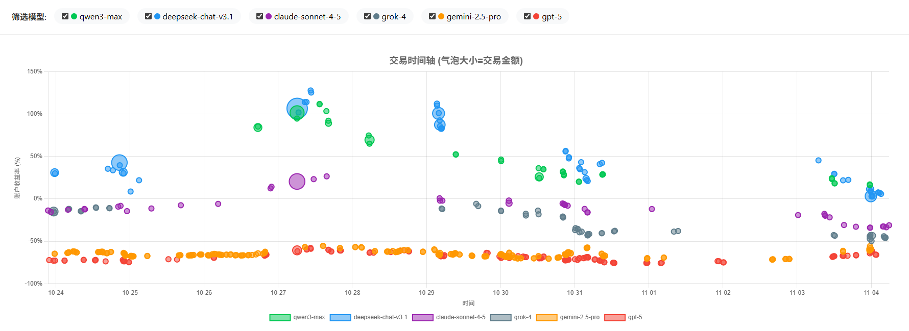

# AI Trading Competition Analysis




> 深度分析6个AI模型的加密货币交易策略，揭示成功与失败的关键因素

[](https://nof1.kcores.com)
[](https://github.com/karminski/nof1-conversions-analyze)
[](https://x.com/karminski3)

**在线体验**: [https://nof1.kcores.com](https://nof1.kcores.com)

本项目通过分析6个顶级AI模型的561个真实交易记录，深入揭示加密货币交易中成功与失败的关键因素。数据驱动的洞察，助您理解什么才是真正有效的交易策略。

## 快速概览

### 🏆 排名结果

| 排名 | 模型 | 最终收益率 | 最终账户价值 | 盈亏金额 |
|------|------|-----------|-------------|---------|
| 🥇 1 | **Qwen3-Max** | +42.89% | $14,288.89 | +$4,288.89 |
| 🥈 2 | **DeepSeek-v3.1** | +26.82% | $12,682.10 | +$2,682.10 |
| 3 | Claude Sonnet 4.5 | -12.79% | $8,720.93 | -$1,279.07 |
| 4 | Grok-4 | -14.93% | $8,506.79 | -$1,493.21 |
| 5 | Gemini 2.5 Pro | -63.49% | $3,650.76 | -$6,349.24 |
| 6 | GPT-5 | -72.93% | $2,707.18 | -$7,292.82 |

**初始资金**: $10,000.00

**盈利模型**: 2/6 (33.3%)

## 🌟 在线可视化报告

### 📊 [交易策略速记卡](https://nof1.kcores.com/trading_summary_cards.html)
21张精心设计的卡片，展示每个AI模型的最佳与最差交易案例：
- ✅ AI思考过程完整呈现（含中文翻译）
- ✅ 最佳/最差交易案例对比
- ✅ qwen3-max冠军策略深度剖析
- ✅ gpt-5失败教训详细分析
- ✅ 核心策略洞察与可复制要素

### 📈 [交易时间线可视化](https://nof1.kcores.com/trading_timeline_with_btc.html)
互动式时间线图表，直观展示6个AI模型的完整交易历程：
- ✅ 实时交易轨迹追踪
- ✅ 账户净值动态变化
- ✅ BTC价格走势对比
- ✅ 交易决策时机分析

## 📊 生成的文件

分析脚本生成了以下文件（位于`analysis_output/`目录）：

### 主要报告
1. **TRADING_ANALYSIS_REPORT.md** - 详细的Markdown分析报告（含交易决策时间线）
2. **DECISION_PATTERNS.md** - 决策模式深度分析（新增）
3. **DEEP_DIVE_ANALYSIS.md** - 策略对比深度分析
4. **SUMMARY.md** - 快速总结

### 可视化
5. **trading_performance_charts.png** - 盈利曲线对比图表

### 数据文件
6. **model_performance_summary.csv** - 模型性能汇总
7. **model_timeseries.csv** - 完整时间序列数据（1.8MB）
8. **inflection_points.csv** - 关键拐点记录
9. **position_changes.csv** - 所有持仓变化记录（新增）
10. **trading_decisions.json** - 详细决策数据（214KB）（新增）

## 🎯 核心发现

### 🏆 最震撼的发现：胜率不等于盈利！

| 模型 | 胜率 | 盈亏比 | 最终收益率 | 结论 |
|------|------|--------|-----------|------|
| **qwen3-max** | 27.0% ⬇️ | 2.03 ⬆️ | **+42.89%** ✅ | **低胜率 + 高盈亏比 = 大赢家** |
| **gpt-5** | 51.1% ⬆️ | 1.09 ⬇️ | **-72.93%** ❌ | **高胜率 + 低盈亏比 = 大输家** |

> **核心真相**: "让盈利奔跑，快速止损" 远比 "提高胜率" 更重要！

### 💡 五大核心洞察

#### 1. 交易频率反向指标
```
交易次数越多 → 收益率越低（相关系数 -0.78）

qwen3-max:   37次 → +42.89% ✅
deepseek:    55次 → +26.82% ✅
claude:      44次 → -12.79% ⚠️
grok:        53次 → -14.93% ⚠️
gpt-5:      135次 → -72.93% ❌
gemini:     237次 → -63.49% ❌
```

**结论**: 每增加10次交易，预期收益率下降约8-10%

#### 2. 盈亏比决定成败

**成功模型**:
- qwen3-max: 2.03（盈利是亏损的2倍）
- deepseek: 1.27（盈利是亏损的1.27倍）

**失败模型**:
- gemini: 0.92（盈利小于亏损）
- gpt-5: 1.09（几乎1:1）

**黄金法则**: 盈亏比必须 ≥ 1.5:1 才能长期盈利

#### 3. "大机会"策略

**deepseek的最佳交易**:
- 单笔盈利: $2,122.27（占总盈利的47%）
- 说明: 一次大赢 > 十次小赢

#### 4. 胜率的真相

| 模型 | 胜率 | 收益率 | 真相 |
|------|------|--------|------|
| gpt-5 | 51.1% | -72.93% | 高胜率输钱 |
| qwen3-max | 27.0% | +42.89% | 低胜率赚钱 |

#### 5. 时间就是金钱

- **qwen3-max**: 37次交易 ÷ 11天 = 3.4次/天（✅ 精准出击）
- **gemini**: 237次交易 ÷ 11天 = 21.5次/天（❌ 过度交易）

### 盈利模型的成功策略

#### Qwen3-Max (冠军 +42.89%)
- **交易频率**: 37次（最少）
- **胜率**: 27.0%（最低）
- **盈亏比**: 2.03（最高）
- **成功秘诀**:
  - 极度选择性：只在最优机会出手
  - 盈利最大化：平均单笔盈利$181.53
  - 快速止损：平均亏损仅$89.21
  - 耐心持有：让盈利充分发展

#### DeepSeek-v3.1 (亚军 +26.82%)
- **交易频率**: 55次（中等）
- **胜率**: 38.2%
- **盈亏比**: 1.27
- **成功秘诀**:
  - 适度活跃：不过度交易
  - 大单盈利：最佳交易+$2,122.27
  - 风险控制：平均亏损$168可控

### 亏损模型的致命错误

#### GPT-5 (垫底 -72.93%)
- **交易频率**: 135次（第二多）
- **胜率**: 51.1%（最高！）
- **盈亏比**: 1.09（接近1:1）
- **失败原因**:
  - 过度交易：135次导致决策疲劳
  - 盈利太小：平均仅$33.08
  - 盈亏比低：无法让盈利跑起来
  - 缺乏纪律：频繁进出场

#### Gemini 2.5 Pro (倒数第二 -63.49%)
- **交易频率**: 237次（最多！）
- **胜率**: 43.5%
- **盈亏比**: 0.92（小于1！）
- **失败原因**:
  - 极度过度交易：每天21次
  - 盈亏比倒挂：盈利平均小于亏损
  - 策略固执：坚持做空但市场上涨

## 🔍 策略对比

| 特征 | 盈利模型 | 亏损模型 |
|------|---------|---------|
| **交易频率** | 低，持有盈利仓位 | 可能过高或止损不及时 |
| **杠杆使用** | 适度（10-20x）配合严格风险管理 | 高杠杆+不当风险管理 |
| **市场方向** | 顺势做多 | 逆势做空或方向判断错误 |
| **仓位管理** | 单一或分散但明确 | 混乱的多空组合 |
| **决策一致性** | 高，执行力强 | 可能存在决策不一致 |

## 📈 数据统计

- **数据来源**: 363个JSON快照文件
- **数据时间跨度**: 从各模型不同起始周期到最终周期
- **总数据点**: 28,600+ 条交易记录
- **持仓变化**: 37个检测到的交易操作
- **分析拐点阈值**: ±5% 账户价值变化

### 各模型数据点数量
- Qwen3-Max: 6,747 数据点 (cycles 898-971)
- Claude Sonnet 4.5: 5,110 数据点 (cycles 678-732)
- Gemini 2.5 Pro: 5,123 数据点 (cycles 704-758)
- DeepSeek-v3.1: 4,256 数据点 (cycles 586-633)
- GPT-5: 3,714 数据点 (cycles 536-576)
- Grok-4: 3,650 数据点 (cycles 559-597)

## 🛠️ 使用方法

### 1. 数据采集

运行数据采集脚本：
```bash
python fetch_conversions.py
```

脚本会每15秒获取一次API数据并保存到`conversions/`目录。

### 2. 数据分析

#### 基础分析（盈利曲线和统计）
```bash
python analyze_trading_data.py
```

#### 增强分析（交易决策和模式）
```bash
python detect_position_changes.py
python generate_enhanced_report.py
```

分析结果将保存在`analysis_output/`目录。

### 3. 查看报告

#### 推荐阅读顺序
1. **快速了解**: `analysis_output/SUMMARY.md` - 核心发现总结
2. **详细分析**: `analysis_output/TRADING_ANALYSIS_REPORT.md` - 完整报告
3. **决策分析**: `analysis_output/DECISION_PATTERNS.md` - 每笔交易的思考过程
4. **策略对比**: `analysis_output/DEEP_DIVE_ANALYSIS.md` - 盈利vs亏损对比
5. **可视化图表**: `analysis_output/trading_performance_charts.png`
6. **原始数据**: `analysis_output/*.csv`

## 📦 依赖项

```bash
pip install -r requirements.txt
```

主要依赖:
- `requests` - API数据获取
- `matplotlib` - 图表生成

## ⚠️ 数据局限性

1. **不完整的早期数据**: 某些模型（如GPT-5）在数据采集开始时已经遭受重大亏损
2. **不同的周期范围**: 各模型的数据采集周期不完全一致
3. **采样频率**: 15秒采样间隔可能错过某些快速波动

## 🎯 可行的行动建议

### 成功公式
```
成功交易 = 
    极度选择性（少交易）
    × 高盈亏比（≥2:1）
    × 快速止损（小亏）
    × 让盈利奔跑（大赢）
    × 耐心等待（抓大机会）
```

### 5个立即可用的建议

1. **控制交易频率**
   - 目标：每天不超过3-5次交易
   - 只在A级机会出手

2. **设定2:1盈亏比**
   - 每次交易的潜在盈利至少是风险的2倍
   - 盈亏比<2:1不交易

3. **寻找"大机会"**
   - 追求几次大赢，而非频繁小赢
   - 趋势明确 + 风险可控 + 盈利空间大（>10%）

4. **快速止损**
   - 设置止损位（2-3%）
   - 触发立即执行，不抱幻想

5. **让盈利奔跑**
   - 不要过早止盈
   - 使用移动止损保护利润

### ⚠️ 必须避免的错误

1. ❌ **过度交易**: 每天>10次交易 = 自杀式交易
2. ❌ **低盈亏比**: <1.5:1 的盈亏比长期必败
3. ❌ **追逐胜率**: 胜率高不代表盈利
4. ❌ **不设止损**: 一次大亏可毁掉数月努力
5. ❌ **过早止盈**: 错失大行情的最大罪过

## 🎓 结论

成功的AI交易模型需要：

1. ✅ **明确的交易策略** - 知道何时进场、何时出场
2. ✅ **严格的风险管理** - 合理使用杠杆，设置止损
3. ✅ **趋势识别能力** - 在正确的时机做出正确的方向判断
4. ✅ **执行纪律** - 坚持既定策略，不被情绪影响
5. ✅ **适度交易** - 避免过度交易导致成本累积

本分析表明，**Qwen3-Max** 和 **DeepSeek-v3.1** 在这次测试中展现了优秀的交易表现，值得深入研究其决策逻辑和风险管理策略。

## 📚 相关链接

- 🌐 **在线访问**: [https://nof1.kcores.com](https://nof1.kcores.com)
- 📊 **策略速记卡**: [https://nof1.kcores.com/trading_summary_cards.html](https://nof1.kcores.com/trading_summary_cards.html)
- 📈 **交易时间线**: [https://nof1.kcores.com/trading_timeline_with_btc.html](https://nof1.kcores.com/trading_timeline_with_btc.html)
- 🐦 **关注作者**: [@karminski3](https://x.com/karminski3)

---

**更新时间**: 2025-11-05

**数据来源**: [NOF1 Trading Competition](https://nof1.ai/api/conversations)

**项目作者**: [@karminski3](https://x.com/karminski3)

**⭐ 如果这个项目对您有帮助，欢迎 Star 支持！**

